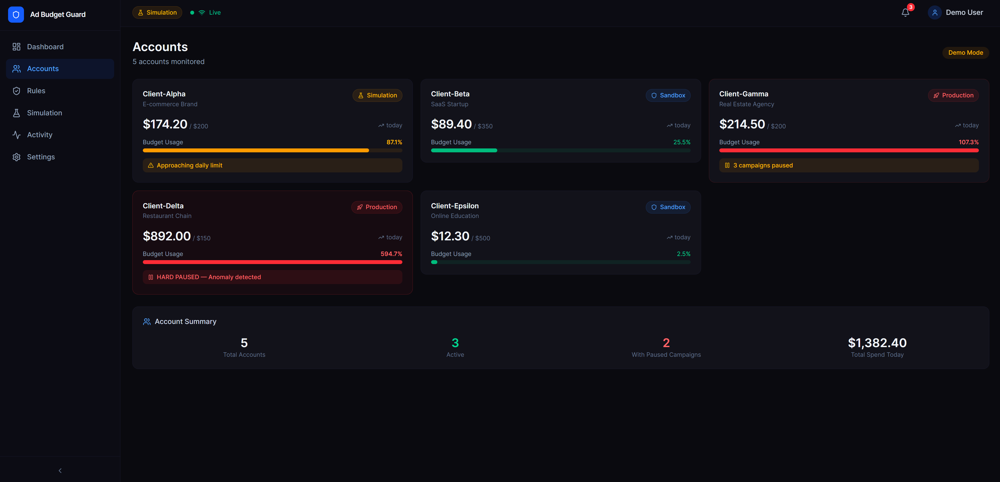
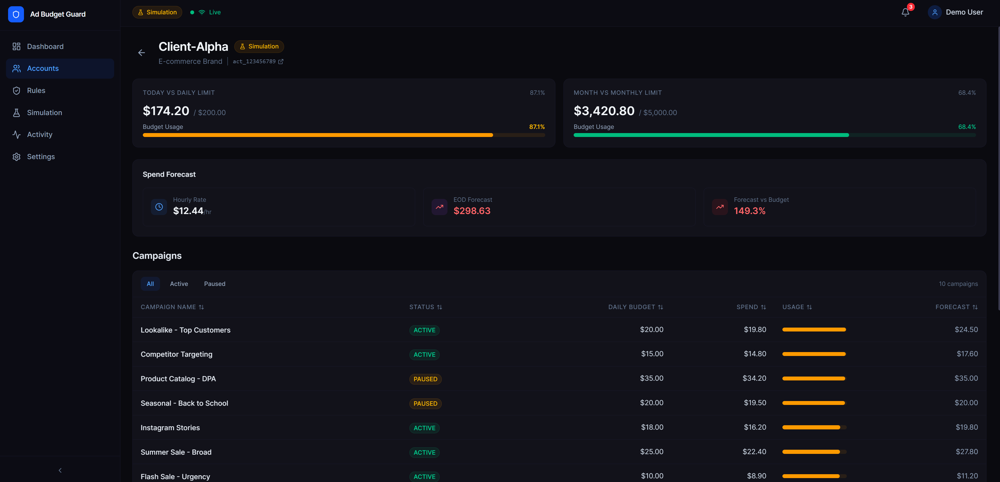
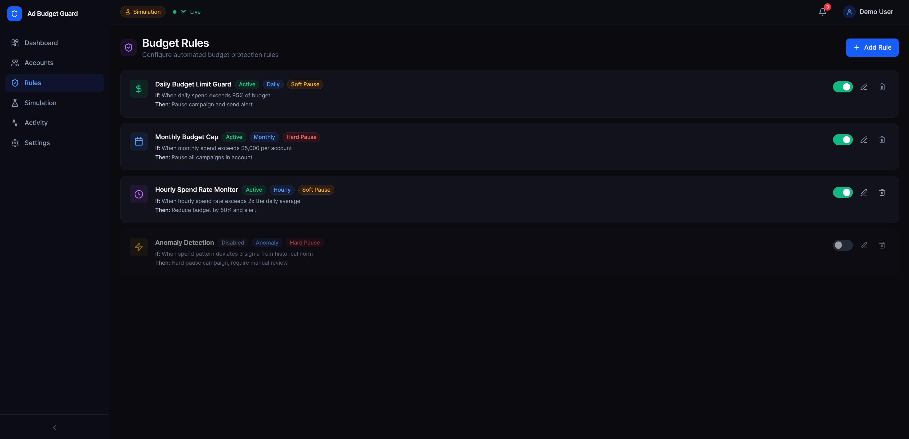
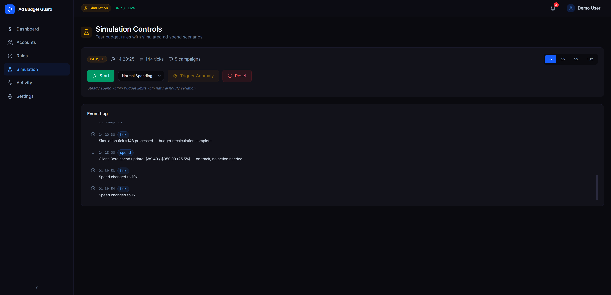
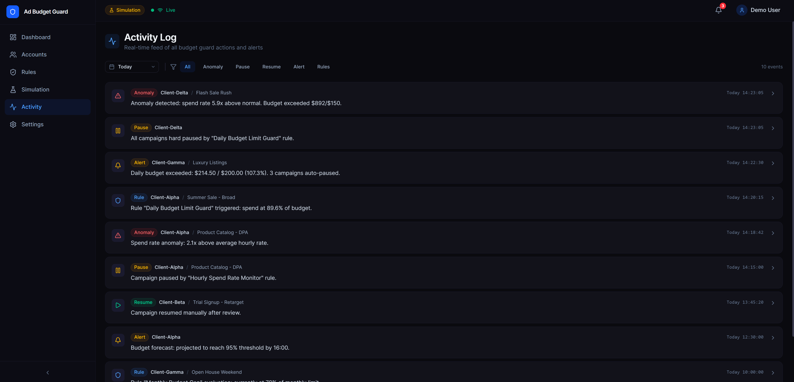
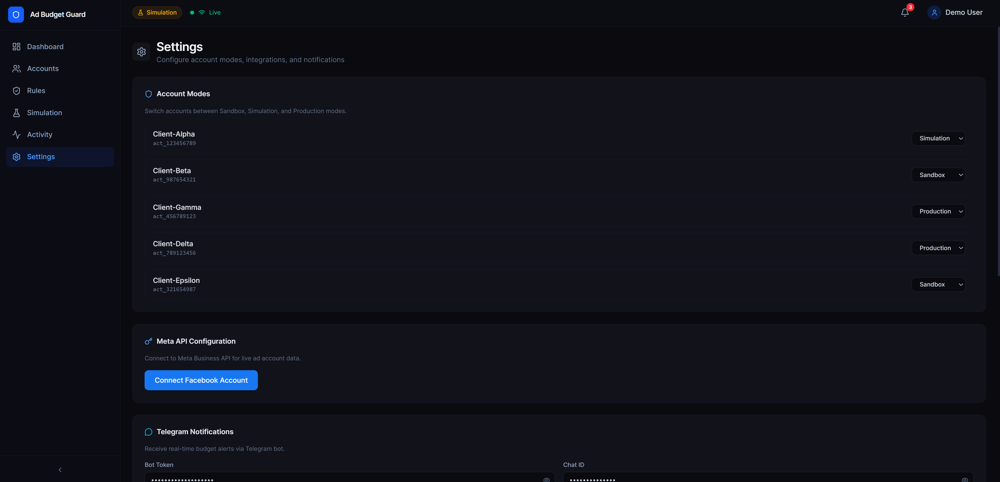
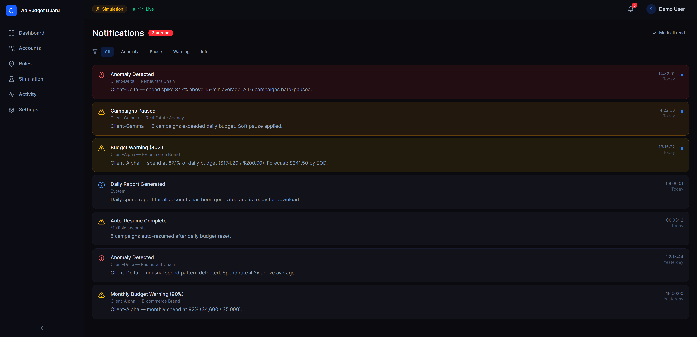
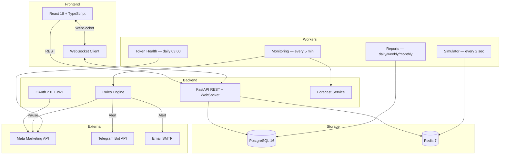

# Ad Budget Guard

> Real-time budget control and security monitoring for Meta Ads. Protects advertising agencies from overspend, anomalies, and unauthorized changes — 24/7, automatically.


---

## The Problem

Advertising agencies lose thousands of dollars every month from:

- **Overnight overspend** — no one watches accounts at 3 AM
- **Account compromises** — hackers change URLs and max out budgets in minutes
- **Human error** — wrong budget setting goes unnoticed until end of day
- **Scale** — manually checking 20+ accounts every 5 minutes is impossible

## The Solution

Ad Budget Guard monitors all your ad accounts in real-time and automatically enforces budget rules — pausing campaigns, sending alerts, and generating reports without any manual intervention.

---

## Features

### Budget Protection
- **4 Rule Types** — Daily limit, Monthly limit, Hourly rate, Anomaly detection (3-sigma)
- **Auto-Pause** — Soft pause (single campaign) or Hard pause (entire account)
- **Spend Forecasting** — Predicts end-of-day spend with weighted average algorithm + weekend multiplier
- **Anomaly Detection** — Catches spend spikes 3x above historical average

### Multi-Account Management
- **Multi-Tenant** — Owner / Manager / Viewer roles per account
- **Meta OAuth** — One-click connect via Facebook Login for Business
- **Auto-Discovery** — Finds all ad accounts and campaigns after OAuth
- **Onboarding Wizard** — 4-step setup: Select Accounts → Set Rules → Configure Alerts → Activate

### Monitoring & Alerts
- **3 Alert Channels** — Telegram, Email (HTML templates), In-app (WebSocket)
- **Alert Deduplication** — Redis cooldown prevents notification spam
- **Real-Time Dashboard** — WebSocket live updates, no manual refresh needed
- **Activity Log** — Every action logged with filters by type, account, date

### Reporting
- **PDF Reports** — Daily/Weekly/Monthly, auto-generated via Celery Beat
- **Google Sheets Export** — One-click export via gspread
- **White-Label Ready** — Agency branding in report headers

### Testing & Demo
- **Simulation Mode** — 4 spend patterns (Steady, PeakHours, Anomaly, Declining)
- **4 Scenarios** — Normal, Approaching Limit, Budget Exceeded, Hack Simulation
- **Speed Control** — 1x / 5x / 10x simulation speed
- **Trigger Anomaly** — One-click 10x spend spike for demo

### Security & Production
- **Token Encryption** — Fernet symmetric encryption at rest
- **Rate Limiting** — slowapi (100 req/min default, 10 req/min on auth)
- **Security Headers** — X-Frame-Options, X-Content-Type-Options, X-XSS-Protection
- **Request Tracking** — UUID per request, X-Request-ID in response
- **Health Check** — DB + Redis connectivity with latency_ms
- **Data Retention** — Auto-cleanup of snapshots older than 90 days

---

## Screenshots

> Screenshots are taken from the running application in Simulation Mode with 5 demo accounts.

| Dashboard | Accounts | Account Detail |
|-----------|----------|---------------|
|  |  |  |

| Budget Rules | Simulation | Activity Log |
|-------------|-----------|-------------|
|  |  |  |

| Settings | Notifications |
|----------|--------------|
|  |  |

---

## Architecture



---

## Quick Start

### Prerequisites
- Docker & Docker Compose
- Meta Developer account (optional — Simulation Mode works without it)

### 1. Clone and configure

```bash
git clone https://github.com/YOUR_USERNAME/ad-budget-guard.git
cd ad-budget-guard
cp .env.production.example .env
# Edit .env with your settings (defaults work for Simulation Mode)
```

### 2. Start all services

```bash
docker compose up -d
```

This starts 6 containers:

| Service | Port | Description |
|---------|------|-------------|
| adbudget-db | 5490 | PostgreSQL 16 |
| adbudget-redis | 6390 | Redis 7 |
| adbudget-api | 8020 | FastAPI backend |
| adbudget-worker | — | Celery worker |
| adbudget-beat | — | Celery beat scheduler |
| adbudget-frontend | 3020 | React app (nginx) |

### 3. Open the dashboard

```
http://localhost:3020
```

The app starts in **Simulation Mode** with 5 demo accounts and pre-configured rules. No Meta API credentials needed.

### 4. Check system health

```bash
curl http://localhost:8020/health
```

```json
{
  "status": "ok",
  "services": {
    "database": { "status": "ok", "latency_ms": 2.0 },
    "redis": { "status": "ok", "latency_ms": 1.7 }
  },
  "version": "1.0.0",
  "uptime_seconds": 86400
}
```

### 5. Connect real Meta accounts (Production Mode)

1. Go to Settings → Click "Connect Facebook Account"
2. Authorize with Facebook (requires `ads_management`, `ads_read` permissions)
3. Complete the onboarding wizard at `/onboarding`
4. System automatically discovers accounts, imports campaigns, and starts monitoring

---

## API Reference

### Authentication
| Method | Endpoint | Description |
|--------|----------|-------------|
| GET | `/api/auth/facebook/login` | Generate OAuth URL with CSRF state |
| POST | `/api/auth/facebook` | Exchange code for JWT tokens |
| POST | `/api/auth/facebook/discover-accounts` | Find all ad accounts |
| POST | `/api/auth/facebook/import-campaigns` | Import campaigns from Meta |
| POST | `/api/auth/refresh` | Refresh JWT token |
| GET | `/api/auth/me` | Current user profile |

### Accounts & Campaigns
| Method | Endpoint | Description |
|--------|----------|-------------|
| GET | `/api/accounts` | List monitored accounts |
| GET | `/api/accounts/{id}` | Account detail with spend |
| GET | `/api/accounts/{id}/campaigns` | Campaigns with status & spend |
| POST | `/api/campaigns/{id}/pause` | Pause campaign |
| POST | `/api/campaigns/{id}/resume` | Resume campaign |

### Budget Rules
| Method | Endpoint | Description |
|--------|----------|-------------|
| GET | `/api/rules/{account_id}` | List rules for account |
| POST | `/api/rules/{account_id}` | Create rule |
| PUT | `/api/rules/{rule_id}` | Update rule |
| DELETE | `/api/rules/{rule_id}` | Delete rule |

### Monitoring & Simulation
| Method | Endpoint | Description |
|--------|----------|-------------|
| GET | `/api/monitoring/spend` | Current spend across accounts |
| POST | `/api/simulation/start` | Start simulator |
| POST | `/api/simulation/pause` | Pause simulator |
| PUT | `/api/simulation/speed` | Set speed (1x/5x/10x) |
| PUT | `/api/simulation/scenario` | Set scenario |
| POST | `/api/simulation/trigger-anomaly` | Trigger 10x spend spike |
| GET | `/api/simulation/status` | Current simulation state |

### Alerts & Reports
| Method | Endpoint | Description |
|--------|----------|-------------|
| GET | `/api/alerts` | Alert history |
| POST | `/api/alerts/test` | Send test alert |
| PUT | `/api/alerts/config/{account_id}` | Configure alert channels |
| POST | `/api/reports/generate` | Generate PDF report |

### System
| Method | Endpoint | Description |
|--------|----------|-------------|
| GET | `/health` | DB + Redis health with latency |

---

## Scheduled Tasks (Celery Beat)

| Task | Schedule | Description |
|------|----------|-------------|
| `check_all_accounts` | Every 5 min | Monitor spend, evaluate rules, trigger actions |
| `simulator_tick` | Every 2 sec | Generate simulated spend data |
| `check_token_health` | Daily 03:00 UTC | Verify Meta tokens, auto-refresh, flag expired |
| `auto_resume_paused` | Daily 00:05 UTC | Resume auto-paused campaigns for new day |
| `generate_daily_report` | Daily 08:00 UTC | Generate PDF report for previous day |
| `generate_weekly_report` | Monday 09:00 | Weekly summary report |
| `generate_monthly_report` | 1st of month 09:00 | Monthly summary report |
| `cleanup_old_reports` | Sunday 04:00 | Delete reports older than retention period |
| `cleanup_old_snapshots` | Sunday 03:00 | Delete spend snapshots older than 90 days |

---

## Database Schema

6 core tables with multi-tenant architecture:

| Table | Purpose |
|-------|---------|
| `users` | OAuth users with encrypted Meta tokens |
| `ad_accounts` | Monitored accounts with mode and budgets |
| `user_accounts` | Junction table with owner/manager/viewer roles |
| `campaigns` | Campaigns with status, budget, spend tracking |
| `spend_snapshots` | Time-series spend data (source: api/simulator) |
| `budget_rules` | Per-account rules with thresholds and actions |
| `simulation_log` | Simulator events and state changes |
| `alert_log` | Alert delivery history with channel and status |
| `alert_configs` | Per-account alert channel configuration |
| `reports` | Generated report metadata and file paths |

---

## Three Operating Modes

| Mode | Data Source | Meta API | Use Case |
|------|-----------|----------|----------|
| **Simulation** | Built-in simulator (4 patterns) | Not needed | Demos, testing, development |
| **Sandbox** | Meta Sandbox account | Real API, $0 spend | Integration testing |
| **Production** | Real ad accounts via OAuth | Full access | Live budget protection |

---

## Testing

```bash
# Backend tests
cd backend && python -m pytest tests/ -v

# Frontend tests
cd frontend && npx vitest run
```

---

## Tech Stack

| Layer | Technology |
|-------|-----------|
| Backend | Python 3.9+ / FastAPI 0.109+ / Pydantic v2 |
| ORM | SQLAlchemy 2.0 (async) + Alembic |
| Task Queue | Celery 5.3+ / Redis 7 |
| Database | PostgreSQL 16 |
| Frontend | React 18 + TypeScript 5.9 + Tailwind CSS v4 + Vite 8 |
| State | Zustand 5 + TanStack Query v5 |
| Charts | Recharts |
| Real-time | WebSocket (FastAPI) + Redis Pub/Sub |
| Security | JWT (HS256), Fernet encryption, slowapi, security headers |
| Reports | WeasyPrint (PDF) + Jinja2, gspread (Google Sheets) |
| Alerts | Telegram (httpx), Email (smtplib + Jinja2), In-app (WebSocket) |
| Deploy | Docker Compose (6 services) |

---

## License

MIT
