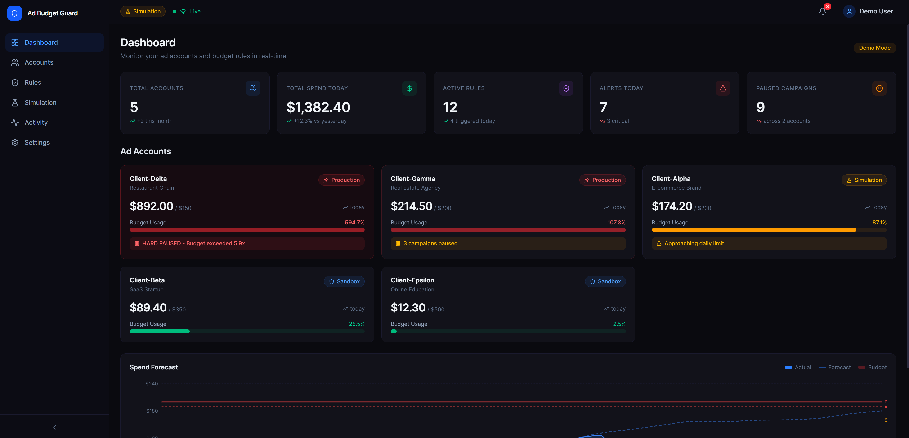
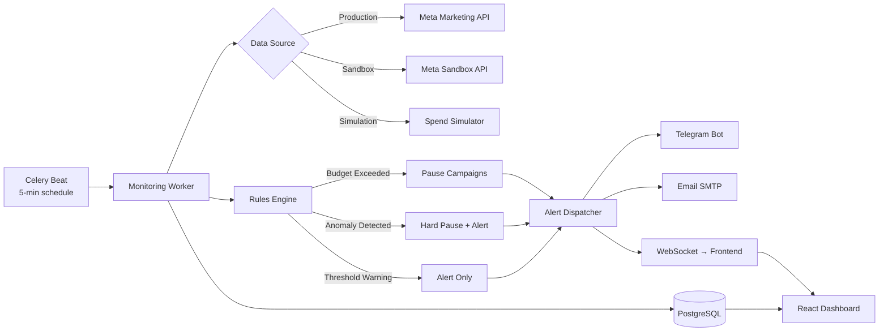

# 🛡️ Ad Budget Guard

**Real-time budget control and security monitoring for Meta (Facebook/Instagram) Ads accounts.**


---

## The Problem

Advertising agencies managing 20+ Meta Ads accounts face a constant risk: **uncontrolled ad spend**. Hackers break in and spike budgets overnight. Employees set $500/day instead of $50. Weekend campaigns run unchecked. The result — thousands of dollars wasted before anyone notices.

Ad Budget Guard monitors spend across all accounts every 5 minutes, automatically pauses campaigns when thresholds are exceeded, detects anomalous spend spikes in real-time, and sends instant alerts via Telegram and email.

---

## Key Features

- 📊 **Real-time Spend Monitoring** — polls Meta API every 5 minutes, tracks spend against daily/monthly budgets
- 🛑 **Auto-Pause Campaigns** — soft pause (individual campaigns) or hard pause (entire account) when limits are hit
- 🔍 **Anomaly Detection** — detects spend spikes 3x+ above average in 15-minute windows, triggers instant hard pause
- 📈 **Spend Forecasting** — predicts end-of-day spend based on current trajectory, warns at 80% / 90% / 100%
- 🔔 **Multi-Channel Alerts** — Telegram, email, and in-app WebSocket notifications with full context
- ⚙️ **Configurable Rules Engine** — per-account and per-campaign rules with priority resolution
- 📋 **Automated Reports** — daily/weekly/monthly PDF reports with spend breakdowns and trend charts
- 🧪 **Built-in Simulator** — test the system with realistic spend patterns without touching real ad accounts

---

## Screenshots

| Dashboard Overview | Account Detail |
|:--:|:--:|
|  |  |

| Rules Editor | Anomaly Detection |
|:--:|:--:|
|  |  |

| Spend Forecast | Simulation Panel |
|:--:|:--:|
|  |  |

| Telegram Alert | PDF Report |
|:--:|:--:|
|  |  |

---

## Architecture



---

## Tech Stack

| Layer | Technology |
|-------|-----------|
| Backend | Python 3.11 · FastAPI · Pydantic v2 |
| Meta Integration | facebook-business SDK · Marketing API v19.0 |
| Frontend | React 18 · TypeScript · Tailwind CSS · Recharts |
| Database | PostgreSQL 15 · SQLAlchemy 2.0 · Alembic |
| Task Queue | Celery · Redis · Celery Beat |
| Real-time | WebSocket / Server-Sent Events |
| Alerts | python-telegram-bot · smtplib |
| Reports | WeasyPrint (PDF) · gspread (Google Sheets) |
| Deploy | Docker Compose (6 services) |

---

## Quick Start

```bash
# 1. Clone the repository
git clone https://github.com/your-username/ad-budget-guard.git
cd ad-budget-guard

# 2. Copy environment file
cp backend/.env.example backend/.env

# 3. Start all services
docker compose up --build -d

# 4. Run database migrations
docker compose exec api alembic upgrade head

# 5. Seed demo data
docker compose exec api python -m app.seed.demo_seeder
```

The dashboard is available at **http://localhost:3020** and the API at **http://localhost:8020**.

---

## Three Operating Modes

### 🧪 Meta Sandbox
Connect to Meta's Sandbox environment — real Graph API calls, real rate limits, real error codes, but $0 actual spend. Perfect for development and testing against the real API surface.

### 🎮 Simulation
Autonomous spend simulator generates realistic spend data in real-time. Configurable patterns — Steady, PeakHours, Anomaly spikes, Declining. No Meta credentials required. Ideal for demos and portfolio showcases.

### 🚀 Production
Client connects their Business Manager via OAuth. Same monitoring code, same rules engine, real money protected. One-click authorization, then the system runs 24/7 autonomously.

---

## How It Works

1. **Celery Beat** triggers a monitoring task every 5 minutes
2. **Monitoring Worker** fetches current spend from Meta API (or simulator)
3. **Spend data** is stored in PostgreSQL with full history
4. **Rules Engine** evaluates all active rules for each account:
   - Compares spend against daily/monthly budgets
   - Calculates hourly spend rate
   - Runs anomaly detection (rolling average comparison)
   - Forecasts end-of-day spend
5. **Actions** are executed based on rule outcomes:
   - *Soft Pause* — pause specific campaigns exceeding their budget
   - *Hard Pause* — pause all campaigns in the account (security response)
   - *Alert Only* — send notification without pausing
6. **Alerts** dispatched via Telegram, email, and WebSocket
7. **Dashboard** updates in real-time via WebSocket connection
8. **Reports** generated on schedule (daily at midnight, weekly on Monday)

---

## API Overview

### Accounts
| Method | Endpoint | Description |
|--------|----------|-------------|
| GET | `/api/accounts` | List all monitored accounts |
| GET | `/api/accounts/{id}` | Account detail with campaigns |
| GET | `/api/accounts/{id}/spend` | Spend history and forecast |
| POST | `/api/accounts/{id}/pause` | Manually pause all campaigns |

### Rules
| Method | Endpoint | Description |
|--------|----------|-------------|
| GET | `/api/accounts/{id}/rules` | List rules for account |
| POST | `/api/accounts/{id}/rules` | Create a new rule |
| PATCH | `/api/rules/{id}` | Update rule (toggle, thresholds) |
| DELETE | `/api/rules/{id}` | Delete a rule |

### Monitoring
| Method | Endpoint | Description |
|--------|----------|-------------|
| GET | `/api/activity` | Recent activity log |
| GET | `/api/alerts` | Alert history |
| GET | `/api/forecast/{account_id}` | Spend forecast for today |
| WS | `/ws/events` | Real-time event stream |

### Simulation
| Method | Endpoint | Description |
|--------|----------|-------------|
| POST | `/api/simulator/start` | Start spend simulation |
| POST | `/api/simulator/stop` | Stop simulation |
| POST | `/api/simulator/anomaly` | Trigger anomaly spike |
| GET | `/api/simulator/status` | Current simulator state |

### Reports
| Method | Endpoint | Description |
|--------|----------|-------------|
| POST | `/api/reports/generate` | Generate PDF report |
| GET | `/api/reports/{id}/download` | Download generated report |

---

## License

MIT — see [LICENSE](LICENSE) for details.
